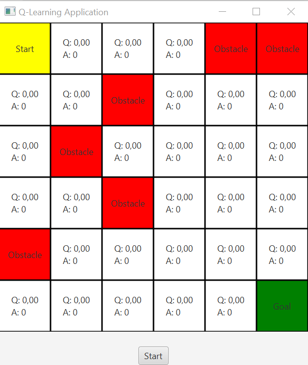

# QLearning Algorithm
Q-Learning is a popular reinforcement learning algorithm used for solving Markov Decision Processes (MDPs). It is a model-free approach, meaning it does not require prior knowledge of the system dynamics or transition probabilities.

Here's a step-by-step overview of the Q-Learning algorithm:

<ol><li><b>Define the MDP:</b> Identify the states, actions, rewards, and transition probabilities of the problem you want to solve. This information is used to construct the Q-table.</li>

<li><b>Initialize the Q-table:</b> Create a table (or matrix) called the Q-table with dimensions (number of states) x (number of actions). Initialize all values in the Q-table to arbitrary values, usually 0.</li>

<li><b>Select an action:</b> Based on the current state, choose an action using an exploration-exploitation strategy. Exploration encourages the agent to try different actions to discover new paths, while exploitation exploits the learned knowledge to select the action with the highest expected reward.</li>

<li><b>Perform the action and observe the next state and reward:</b> Execute the chosen action in the environment and observe the resulting next state and the associated reward.</li>

<li><b>Update the Q-table:</b> Use the observed information to update the Q-value for the current state-action pair using the Q-learning update equation:

Q(s, a) = Q(s, a) + α * (r + γ * max(Q(s', a')) - Q(s, a))

Where:

<ul><li>Q(s, a) is the Q-value of state s and action a.</li>
<li>α (alpha) is the learning rate that determines the weight given to the new information. It usually has a value between 0 and 1.</li>
<li>r is the observed reward after taking action a in state s.</li>
<li>γ (gamma) is the discount factor that balances the importance of immediate and future rewards. It also has a value between 0 and 1.</li>
<li>max(Q(s', a')) is the maximum Q-value over all possible actions in the next state s'.</li></ul>
<li>Repeat steps 3-5 until convergence or a predefined number of iterations.</li>
<li>Exploit the learned policy: Once the Q-table has converged or the algorithm has finished iterating, the agent can exploit the learned policy by selecting the action with the highest Q-value for each state.</li></ol>

Q-Learning is an iterative process that continues to update the Q-values until it converges to the optimal values. It gradually learns the optimal policy by interacting with the environment, updating the Q-values based on the observed rewards, and exploiting the learned knowledge to make better decisions.

Note that there are variations of Q-Learning, such as SARSA (State-Action-Reward-State-Action), which updates the Q-values based on the next state and action pair rather than the maximum Q-value. SARSA is an on-policy algorithm, whereas Q-Learning is an off-policy algorithm that updates Q-values based on the maximum Q-value of the next state.
## Sequantial Method
### Qlearning class
This class represents a grid environment where an agent learns to navigate from the top-left corner (0, 0) to the bottom-right corner (GRID_SIZE-1, GRID_SIZE-1). Here's an overview of the code:

<ul><li>The Qlearning class contains various parameters and variables used in the Q-learning algorithm.</li>
<li>The grid represents the environment, where 0 denotes an empty cell, -1 denotes an obstacle, and 1 denotes the goal state.</li>
<li>The qTable is a 2D array that stores the Q-values for each state-action pair.</li>
<li>The actions array defines the possible actions the agent can take (left, right, down, up).</li>
<li>The chooseAction method selects an action based on an exploration-exploitation strategy, using the epsilon-greedy approach. It returns the index of the chosen action.</li>
<li>The executeAction method performs the chosen action and updates the agent's position in the grid.</li>
<li>The finished method checks if the agent has reached the goal state.</li>
<li>The showResult method displays the learned Q-values in the qTable and demonstrates the agent's path from the start to the goal state.</li>
<li>The runQlearning method implements the Q-learning algorithm by iterating over episodes and updating the Q-values based on the observed rewards.
</li></ul>

```
import java.util.ArrayList;
import java.util.List;
import java.util.Random;

public class Qlearning {
    private final double ALPHA=0.1;
    private final double GAMMA=0.9;
    private final double EPS=0.4;
    private final int MAX_EPOCH=90000;
    private final int GRID_SIZE=6;
    private final int ACTION_SIZE=4;
    private int [][] grid;
    private double [][]qTable=new double[GRID_SIZE*GRID_SIZE][ACTION_SIZE];
    private int [][] actions;
    private int stateI;
    private int stateJ;
    List<Integer> StateIL=new ArrayList<>();
    List<Integer> StateJL=new ArrayList<>();

    public Qlearning(){
        actions=new int[][]{
                {0,-1},//gauche
                {0,1},//droit
                {1,0},//bas
                {-1,0}//haut
        };
        grid=new int[][]{
                {0, 0,0,0,-1,-1},
                {0, 0,-1,0,0,0},
                {0, -1,0,0,0,0},
                {0, 0,-1,0,0,0},
                {-1, 0,0,0,0,0},
                {0, 0,0,0,0,1}
        };
    }
    void resetState(){
        stateI=0;
        stateJ=0;
    }

    public int getStateI() {
        return stateI;
    }

    public int getStateJ() {
        return stateJ;
    }

    int chooseAction(double eps){
        Random rnd=new Random();
        double bestQ=0;
        int action=0;
        if (rnd.nextDouble()<eps){
            //Exploration
            action=rnd.nextInt(ACTION_SIZE);

        }else{
            //Exploitation
            int st=stateI*GRID_SIZE+stateJ;
            for(int i=0;i<ACTION_SIZE;i++){
                if(qTable[st][i]>bestQ){
                    bestQ=qTable[st][i];
                    action=i;
                }
            }


        }
        return action;
    }
    int executeAction(int act){
        stateI=Math.max(0,Math.min(actions[act][0]+stateI,GRID_SIZE-1));
        stateJ=Math.max(0,Math.min(actions[act][1]+stateJ,GRID_SIZE-1));
        return stateI*GRID_SIZE+stateJ;

    }
    boolean finished(){
        return grid[stateI][stateJ]==1;
    }
    void showResult(){
        for (double []line:qTable){
            System.out.print("[");
            for(double qvalue:line){
                System.out.print(qvalue+",");
            }
           System.out.println("]");

        }
        resetState();
        int i=0;
        while (!finished()){
            int act=chooseAction(0);
            System.out.println(stateI*GRID_SIZE+stateJ+" Action: "+act);
            StateIL.add(stateI);
            StateJL.add(stateJ);
            i++;
            executeAction(act);
        }
        System.out.println("Final state :"+stateI+ " "+stateJ);

    }
    public void runQlearning(){
        int it=0;
        int currentState;
        int nextState;
        int act,act1;
        while (it<MAX_EPOCH){
            resetState();
            while(!finished()){
                currentState=stateI*GRID_SIZE+stateJ;
                //System.out.println(currentState);
                act=chooseAction(0.4);
                nextState=executeAction(act);
                act1=chooseAction(0);

                qTable[currentState][act]=qTable[currentState][act]+ALPHA*(grid[stateI][stateJ]+GAMMA*qTable[nextState][act1]-qTable[currentState][act]);
                //System.out.println(qTable[currentState][act]);


            }
            it++;
        }

        showResult();
    }

    public int getMAX_EPOCH() {
        return MAX_EPOCH;
    }

    public double getEPS() {
        return EPS;
    }

    public double[][] getqTable() {
        return qTable;
    }

    public double getALPHA() {
        return ALPHA;
    }

    public double getGAMMA() {
        return GAMMA;
    }

    public int getGRID_SIZE() {
        return GRID_SIZE;
    }

    public int getACTION_SIZE() {
        return ACTION_SIZE;
    }

    public int[][] getGrid() {
        return grid;
    }

    public int[][] getActions() {
        return actions;
    }
}

```
### FX Application
This application represents a graphical user interface (GUI) for visualizing the Q-learning process and displaying the learned Q-values and optimal path. Here's an overview of the code:

<ul><li>The HelloApplication class extends the JavaFX Application class, which allows you to create a graphical application.</li>
<li>The qlearning variable is an instance of the Qlearning class, which handles the Q-learning algorithm.</li>
<li>The gridPane is a container for displaying the grid environment.</li>
<li>The gridLabels array stores labels representing each cell in the grid.</li>
<li>The start method is the entry point for the GUI application. It sets up the gridPane, labels, and start button, and defines their behaviors.</li>
<li>The updateGrid method updates the grid visualization based on the Q-values learned by the Q-learning algorithm. It assigns colors to cells based on their states, displays the maximum Q-value and associated action, and highlights the start and goal states.</li>
<li>The displayOptimalPath method highlights the optimal path found by the Q-learning algorithm by changing the background color of the corresponding cells to yellow.</li>
<li>The main method launches the JavaFX application.</li></ul>

```
import javafx.application.Application;
import javafx.geometry.Pos;
import javafx.scene.Scene;
import javafx.scene.control.Button;
import javafx.scene.control.Label;
import javafx.scene.layout.*;
import javafx.stage.Stage;

import java.util.List;

public class HelloApplication extends Application {

        private Qlearning qlearning;

        private GridPane gridPane;
        private Label[][] gridLabels;
        int[][] grid ;

        @Override
        public void start(Stage primaryStage) {
            qlearning = new Qlearning();

            gridPane = new GridPane();
            gridLabels = new Label[qlearning.getGRID_SIZE()][qlearning.getGRID_SIZE()];

            for (int i = 0; i < qlearning.getGRID_SIZE(); i++) {
                for (int j = 0; j < qlearning.getGRID_SIZE(); j++) {
                    Label label = new Label();
                    label.setMinSize(70, 70);
                    label.setAlignment(Pos.CENTER);
                    label.setStyle("-fx-border-color: black;");
                    gridLabels[i][j] = label;
                    gridPane.add(label, j, i);
                }
            }

            Button startButton = new Button("Start");
            startButton.setOnAction(event -> {
                qlearning.runQlearning();
                updateGrid();
                displayOptimalPath();
            });

            HBox buttonBox = new HBox(startButton);
            buttonBox.setAlignment(Pos.CENTER);

            VBox root = new VBox(gridPane, buttonBox);
            root.setAlignment(Pos.CENTER);
            root.setSpacing(20);

            updateGrid();

            Scene scene = new Scene(root);
            primaryStage.setTitle("Q-Learning Application");
            primaryStage.setScene(scene);
            primaryStage.show();
        }

        private void updateGrid() {
            int[][] grid = qlearning.getGrid();
            double[][] qTable = qlearning.getqTable();
            qlearning.resetState();
            int stateIstart=qlearning.getStateI();
            int stateJstart=qlearning.getStateJ();

            for (int i = 0; i < qlearning.getGRID_SIZE(); i++) {
                for (int j = 0; j < qlearning.getGRID_SIZE(); j++) {
                    if(i==stateIstart && j==stateJstart){
                        System.out.println(i+" "+j);
                        gridLabels[i][j].setText("Start");
                        gridLabels[i][j].setStyle("-fx-background-color: yellow; -fx-border-color: black;");
                    }else if (grid[i][j] == 1) {
                        gridLabels[i][j].setText("Goal");
                        gridLabels[i][j].setStyle("-fx-background-color: green; -fx-border-color: black;");
                    } else if (grid[i][j] == -1) {
                        gridLabels[i][j].setText("Obstacle");
                        gridLabels[i][j].setStyle("-fx-background-color: red; -fx-border-color: black;");
                    } else {
                        int state = i * qlearning.getGRID_SIZE() + j;
                        double maxQValue = Double.NEGATIVE_INFINITY;
                        int maxAction = 0;
                        for (int k = 0; k < qlearning.getACTION_SIZE(); k++) {
                            if (qTable[state][k] > maxQValue) {
                                maxQValue = qTable[state][k];
                                maxAction = k;
                            }
                        }
                        gridLabels[i][j].setText("Q: " + String.format("%.2f", maxQValue) + "\nA: " + maxAction);
                        gridLabels[i][j].setStyle("-fx-background-color: white; -fx-border-color: black;");
                    }
                }
            }
        }

        private void displayOptimalPath() {
               List<Integer>I=qlearning.StateIL;
               List<Integer>J=qlearning.StateJL;
            for (int i=0;i<I.size();i++) {
                gridLabels[I.get(i)][J.get(i)].setStyle("-fx-background-color: yellow; -fx-border-color: black;");
            }
        }


        public static void main(String[] args) {
            launch(args);
        }
    }
```
### Execution 
<pre style="background-color: white">
                                
     

</pre>
## SMA_Island Method
### MainContainer class
The MainContainer is a platform for developing and running intelligent agents in Java. The main method initializes the JADE runtime and creates a main container with a graphical user interface (GUI) enabled. The main container serves as the central hub for hosting agents and managing agent communication and execution. Starting the main container launches the JADE platform, allowing agents to be deployed and interact within the multi-agent system. The JADE framework provides a robust infrastructure for building distributed, autonomous systems that can exhibit intelligent behavior and perform tasks in a coordinated manner.

```
import jade.core.Profile;
import jade.core.ProfileImpl;
import jade.core.Runtime;
import jade.wrapper.AgentContainer;
import jade.wrapper.ControllerException;

public class MainContainer {
    public static void main(String[] args) throws ControllerException {
        Runtime runtime=Runtime.instance();
        ProfileImpl profile=new ProfileImpl();
        profile.setParameter(Profile.GUI,"true");
        AgentContainer mainContainer = runtime.createMainContainer(profile);
        mainContainer.start();
    }
}
```
### SimpleContainer class
The main method creates a JADE runtime instance and sets up a container using the specified profile. The Profile.MAIN_HOST parameter is set to "localhost", indicating that the container will be hosted on the local machine.

Agents are then created and deployed within the container using the createNewAgent method of the agentContainer object. The AgentMaster agent is created with the name "mainAgent" and started, while multiple instances of the AgentIsland agent are created with unique names and also started.

```
import jade.core.Profile;
import jade.core.ProfileImpl;
import jade.core.Runtime;
import jade.wrapper.AgentContainer;
import jade.wrapper.AgentController;
import jade.wrapper.ControllerException;

public class SimpleContainer {
    public static void main(String[] args) throws ControllerException {
        Runtime runtime=Runtime.instance();
        ProfileImpl profile=new ProfileImpl();
        profile.setParameter(Profile.MAIN_HOST,"localhost");
        AgentContainer agentContainer = runtime.createAgentContainer(profile);
        AgentController masterAgent=agentContainer.createNewAgent("mainAgent", AgentMaster.class.getName(), new Object[]{});
        masterAgent.start();
        for (int i=0;i <QUtils.Island_size;i++){
            AgentController islandAgent=agentContainer.createNewAgent(String.valueOf(i), AgentIsland.class.getName(), new Object[]{});
            islandAgent.start();
        }
    }
}

```

### AgentIsland class 
The AgentIsland class extends the Agent class from the JADE framework. Here's an overview of the code:

<ol><li><b>Agent Initialization:</b> The agent's initial state is defined with variables stateI and stateJ. The agent's Q-table is represented by a 2D array called qTable, where each element stores the Q-values for different state-action pairs.</li>

<li><b>Agent Behavior: </b>The agent's behavior is defined in the setup() method, which is overridden from the Agent class. The agent executes a sequential behavior consisting of two sub-behaviors: a Behaviour and a OneShotBehaviour.

a. Behaviour: This behavior is executed repeatedly until a certain condition is met. It represents the agent's Q-learning process. The agent chooses actions, updates the Q-values in the Q-table, and transitions to the next state based on the chosen action. The Q-values are updated using the Q-learning formula.

b. OneShotBehaviour: This behavior is executed once after the Behaviour completes. It is responsible for sending a message to another agent in the system. The agent searches for the agent with the service type "QA" using the DFService.search() method. The agent then creates an ACL message, converts the Q-table into a string representation, sets the message content, and sends the message to the identified agent.</li>

<li><b>Helper Methods:</b> The agent also includes several helper methods such as resetState(), chooseAction(), executeAction(), and finished(). These methods are used within the agent's behavior to manage the agent's state, choose actions based on exploration/exploitation, execute actions, and determine if the agent has reached a terminal state.</li></ol>

```
import jade.core.Agent;
import jade.core.behaviours.Behaviour;
import jade.core.behaviours.OneShotBehaviour;
import jade.core.behaviours.SequentialBehaviour;
import jade.domain.DFService;
import jade.domain.FIPAAgentManagement.DFAgentDescription;
import jade.domain.FIPAAgentManagement.ServiceDescription;
import jade.domain.FIPAException;
import jade.lang.acl.ACLMessage;

import java.util.Random;

public class AgentIsland extends Agent {

    private double[][] qTable = new double[QUtils.GRID_SIZE * QUtils.GRID_SIZE][QUtils.ACTION_SIZE];
    private int stateI;
    private int stateJ;

    @Override
    protected void setup() {

        SequentialBehaviour sequentialBehaviour = new SequentialBehaviour();

        sequentialBehaviour.addSubBehaviour(new Behaviour() {
            int it = 0;
            int currentState;
            int nextState;
            int act, act1;

            @Override
            public void action() {
                resetState();
                while (!finished()) {
                    currentState = stateI * QUtils.GRID_SIZE + stateJ;
                    //System.out.println(currentState);
                    act = chooseAction(0.4);
                    nextState = executeAction(act);
                    act1 = chooseAction(0);

                    qTable[currentState][act] = qTable[currentState][act] + QUtils.ALPHA * (QUtils.grid[stateI][stateJ] + QUtils.GAMMA * qTable[nextState][act1] - qTable[currentState][act]);
                    //System.out.println(qTable[currentState][act]);


                }
                it++;
            }

            @Override
            public boolean done() {
                return it > QUtils.MAX_EPOCH || it == QUtils.MAX_EPOCH;
            }
        });
        sequentialBehaviour.addSubBehaviour(new OneShotBehaviour() {
            @Override
            public void action() {
                DFAgentDescription dfAgentDescription = new DFAgentDescription();
                ServiceDescription serviceDescription = new ServiceDescription();
                serviceDescription.setType("QA");
                dfAgentDescription.addServices(serviceDescription);
                DFAgentDescription[] dfAgentDescriptions;
                try {
                    dfAgentDescriptions = DFService.search(getAgent(), dfAgentDescription);
                } catch (FIPAException e) {
                    throw new RuntimeException(e);
                }
                ACLMessage aclMessage = new ACLMessage(ACLMessage.INFORM);
                aclMessage.addReceiver(dfAgentDescriptions[0].getName());
                //// Convertir le tableau en une chaîne de caractères
                StringBuilder contenuBuilder = new StringBuilder();
                for (double[] ligne : qTable) {
                    for (double valeur : ligne) {
                        contenuBuilder.append(valeur);
                        contenuBuilder.append(" ");
                    }
                    contenuBuilder.append(",");
                }
                contenuBuilder.deleteCharAt(contenuBuilder.length() - 1);
                String contenu = contenuBuilder.toString();
                //System.out.println(contenu);

                // Ajouter le contenu au message
                aclMessage.setContent(contenu);
                //aclMessage.setContent(showResult());
                send(aclMessage);
            }
        });
        addBehaviour(sequentialBehaviour);
    }

    private void resetState() {
        stateI = 0;
        stateJ = 0;
    }

    private int chooseAction(double eps) {
        Random rnd = new Random();
        double bestQ = 0;
        int action = 0;
        if (rnd.nextDouble() < eps) {
            //Exploration
            action = rnd.nextInt(QUtils.ACTION_SIZE);

        } else {
            //Exploitation
            int st = stateI * QUtils.GRID_SIZE + stateJ;
            for (int i = 0; i < QUtils.ACTION_SIZE; i++) {
                if (qTable[st][i] > bestQ) {
                    bestQ = qTable[st][i];
                    action = i;
                }
            }


        }
        return action;
    }

    private int executeAction(int act) {
        stateI = Math.max(0, Math.min(QUtils.actions[act][0] + stateI, QUtils.GRID_SIZE-1));
        stateJ = Math.max(0, Math.min(QUtils.actions[act][1] + stateJ, QUtils.GRID_SIZE-1));
        return stateI * QUtils.GRID_SIZE + stateJ;

    }

    private boolean finished() {
        return QUtils.grid[stateI][stateJ] == 1;
    }
}
```
### AgentMaster class 
AgentMaster extends the Agent class from the JADE framework. Here's an overview of the code:

<ol><li><b>Agent Initialization:</b> In the setup() method, the agent registers itself with the Directory Facilitator (DF) using the DFService.register() method. It provides a service description indicating that it provides the service type "QA" and has the name "master". This allows other agents to search for and communicate with this agent.</li>

<li><b>Agent Behavior: </b>The agent's behavior is defined in a Behaviour implementation. This behavior is responsible for receiving a message from another agent in the system. The agent waits for a message using the blockingReceive() method, which will block until a message is received. Upon receiving the message, the agent extracts the content of the message, which is assumed to be a representation of a Q-table.</li>

<li><b>Q-table Processing:</b> The received content is processed to convert it into a double[][] array representing the Q-table. The content is split into individual lines, and each line is split into values. These values are then parsed into double values and stored in the tableau array.</li>

<li><b>User Interface Integration:</b> The Platform.startup() method is used to start the JavaFX application. An instance of the ApplicationFx class is created, and the tableau array is set as the Q-table data in the applicationFx object. The application is then started by calling applicationFx.start(new Stage()).</li>

<li><b>Termination Condition:</b> The done() method is overridden to specify the termination condition of the behavior. In this case, the behavior terminates after receiving one message. This ensures that the agent processes only one Q-table update.</li></ol>

This agent class represents the master agent in a distributed Q-learning system. It registers itself with the DF, receives Q-table updates from other agents, and integrates the Q-table data into a JavaFX user interface for visualization and interaction.

```
import jade.core.Agent;
import jade.core.behaviours.Behaviour;
import jade.domain.DFService;
import jade.domain.FIPAAgentManagement.DFAgentDescription;
import jade.domain.FIPAAgentManagement.ServiceDescription;
import jade.domain.FIPAException;
import jade.lang.acl.ACLMessage;
import javafx.application.Platform;
import javafx.stage.Stage;
public class AgentMaster extends Agent {

    @Override
    protected void setup() {
        DFAgentDescription dfAgentDescription=new DFAgentDescription();
        dfAgentDescription.setName(getAID());
        ServiceDescription serviceDescription=new ServiceDescription();
        serviceDescription.setType("QA");
        serviceDescription.setName("master");
        dfAgentDescription.addServices(serviceDescription);
        try {
            DFService.register(this,dfAgentDescription);
        } catch (FIPAException e) {
            e.printStackTrace();
        }
        addBehaviour(new Behaviour() {
            int i=0;
            @Override
            public void action() {
                ACLMessage aclMessage=blockingReceive();
                i++;
                if(aclMessage!=null){
                    // Extraire le contenu du message (tableau)
                    String contenu = aclMessage.getContent();
                    String[] lignes = contenu.split(",");

                    // Calculer les dimensions du tableau double
                    int nbLignes = lignes.length;
                    int nbColonnes = lignes[0].split(" ").length;

                    // Convertir les chaînes de caractères en tableau double à deux dimensions
                    double[][] tableau = new double[nbLignes][nbColonnes];
                    int index = 0;
                    for (int i = 0; i < nbLignes; i++) {
                        String []ligne= lignes[index].split(" ");
                        for (int j = 0; j < nbColonnes; j++) {
                            tableau[i][j] = Double.parseDouble(ligne[j]);

                        }
                        index++;
                    }


                    Platform.startup(() -> {
                        ApplicationFx applicationFx = new ApplicationFx();
                        applicationFx.setqTable(tableau);
                        applicationFx.start(new Stage());

                    });

                }else {
                    block();
                }

            }

            @Override
            public boolean done() {
                return i==1;
            }
        });
    }

}

```
### QUtils class 

```
public class QUtils {
public static final double ALPHA=0.1;
public static final double GAMMA=0.9;
public static final double EPS=0.4;
public static final int MAX_EPOCH=90000;
public static final int GRID_SIZE=6;
public static final int ACTION_SIZE=4;
public static final int Island_size=3;
public static final int [][] grid = new int[][]{
{0, 0,0,0,0,0},
{0, 0,-1,0,0,0},
{0, -1,0,0,0,0},
{0, 0,-1,0,0,0},
{-1, 0,0,0,0,0},
{0, 0,0,0,0,1}
};
public static final int[][] actions = new int[][]{
{0, -1},//gauche
{0, 1},//droit
{1, 0},//bas
{-1, 0}//haut
};
}
```
### FX Application 
ApplicationFx extends the Application class. Here's an overview of the code:

<ol><li><b>Class Variables:</b> The class includes various instance variables, such as qTable, gridPane, gridLabels, stateI, stateJ, StateIL, and StateJL, used to store and manage the Q-table data, grid UI elements, and current states.</li>

<li><b>Application Initialization:</b> The start() method is overridden from the Application class and is the entry point of the JavaFX application. It initializes the UI components, including a grid pane to represent the environment grid and a start button.</li>

<li><b>Grid UI Initialization:</b> The updateGrid() method updates the grid UI based on the provided Q-table. It iterates over each cell in the grid, sets the text and style of each label based on the corresponding grid value and Q-values from the Q-table.</li>

<li><b>Displaying Optimal Path:</b> The displayOptimalPath() method is called when the start button is clicked. It calls the showResult() method to determine the optimal path based on the Q-table and updates the UI to highlight the cells in the optimal path.</li>

<li><b>Q-learning Actions:</b> The chooseAction() method selects an action based on a given epsilon value, which determines whether to explore or exploit the Q-table. The executeAction() method executes the chosen action and updates the current state accordingly.</li>

<li><b>Termination Condition:</b> The finished() method checks if the current state corresponds to the goal state, indicating the termination of the Q-learning process.</li>

<li><b>Showing the Result:</b> The showResult() method executes the Q-learning process by repeatedly choosing actions, updating the states, and collecting the state history in StateIL and StateJL lists.</li>

<li><b>Launching the Application:</b> The launchApp() method is used to start the JavaFX application. It sets the provided tableau (Q-table) and calls the launch() method to initiate the JavaFX application.</li></ol>

This class serves as the user interface for visualizing the Q-learning process and displaying the optimal path. It receives the Q-table from the AgentMaster agent, updates the UI grid, and allows the user to start the Q-learning process and visualize the optimal path.

```
import javafx.application.Application;
import javafx.geometry.Pos;
import javafx.scene.Scene;
import javafx.scene.control.Button;
import javafx.scene.control.Label;
import javafx.scene.layout.GridPane;
import javafx.scene.layout.HBox;
import javafx.scene.layout.VBox;
import javafx.stage.Stage;

import java.util.ArrayList;
import java.util.List;
import java.util.Random;

public class ApplicationFx extends Application {
        double[][] qTable ;

        private GridPane gridPane;
        private Label[][] gridLabels;
        int stateI = 0;
        int stateJ = 0;
    List<Integer> StateIL=new ArrayList<>();
    List<Integer> StateJL=new ArrayList<>();


    public void setqTable(double[][] qTable) {
        this.qTable = qTable;
        //System.out.println(this.qTable);

    }

    @Override
        public void start(Stage primaryStage) {

            gridPane = new GridPane();
            gridLabels = new Label[QUtils.GRID_SIZE][QUtils.GRID_SIZE];

            for (int i = 0; i < QUtils.GRID_SIZE; i++) {
                for (int j = 0; j < QUtils.GRID_SIZE; j++) {
                    Label label = new Label();
                    label.setMinSize(70, 70);
                    label.setAlignment(Pos.CENTER);
                    label.setStyle("-fx-border-color: black;");
                    gridLabels[i][j] = label;
                    gridPane.add(label, j, i);
                }
            }

            Button startButton = new Button("Start");
            startButton.setOnAction(event -> {
                //qlearning.runQlearning();
                updateGrid(this.qTable);
                displayOptimalPath();
            });

            HBox buttonBox = new HBox(startButton);
            buttonBox.setAlignment(Pos.CENTER);

            VBox root = new VBox(gridPane, buttonBox);
            root.setAlignment(Pos.CENTER);
            root.setSpacing(20);

            updateGrid(new double[QUtils.GRID_SIZE*QUtils.GRID_SIZE][QUtils.ACTION_SIZE]);

            Scene scene = new Scene(root);
            primaryStage.setTitle("Q-Learning Application SMA");
            primaryStage.setScene(scene);
            primaryStage.show();
        }

        void updateGrid(double[][] qTable) {


            for (int i = 0; i < QUtils.GRID_SIZE; i++) {
                for (int j = 0; j < QUtils.GRID_SIZE; j++) {
                    if(i==stateI && j==stateJ){
                        System.out.println(i+" "+j);
                        gridLabels[i][j].setText("Start");
                        gridLabels[i][j].setStyle("-fx-background-color: yellow; -fx-border-color: black;");
                    }else if (QUtils.grid[i][j] == 1) {
                        gridLabels[i][j].setText("Goal");
                        gridLabels[i][j].setStyle("-fx-background-color: green; -fx-border-color: black;");
                    } else if (QUtils.grid[i][j] == -1) {
                        gridLabels[i][j].setText("Obstacle");
                        gridLabels[i][j].setStyle("-fx-background-color: red; -fx-border-color: black;");
                    } else {
                        int state = i * QUtils.GRID_SIZE + j;
                        double maxQValue = Double.NEGATIVE_INFINITY;
                        int maxAction = 0;
                        for (int k = 0; k < QUtils.ACTION_SIZE; k++) {
                            if (qTable[state][k] > maxQValue) {
                                maxQValue = qTable[state][k];
                                maxAction = k;
                            }
                        }
                        gridLabels[i][j].setText("Q: " + String.format("%.2f", maxQValue) + "\nA: " + maxAction);
                        gridLabels[i][j].setStyle("-fx-background-color: white; -fx-border-color: black;");
                    }
                }
            }
        }

        private void displayOptimalPath() {
            showResult();
            for (int i=0;i<StateIL.size();i++) {
                gridLabels[StateIL.get(i)][StateJL.get(i)].setStyle("-fx-background-color: yellow; -fx-border-color: black;");
            }
        }
    int chooseAction(double eps){
        Random rnd=new Random();
        double bestQ=0;
        int action=0;
        if (rnd.nextDouble()<eps){
            //Exploration
            action=rnd.nextInt(QUtils.ACTION_SIZE);

        }else{
            //Exploitation
            int st=stateI*QUtils.GRID_SIZE+stateJ;
            for(int i=0;i<QUtils.ACTION_SIZE;i++){
                if(qTable[st][i]>bestQ){
                    bestQ=qTable[st][i];
                    action=i;
                }
            }


        }
        return action;
    }
    int executeAction(int act){
        stateI=Math.max(0,Math.min(QUtils.actions[act][0]+stateI,QUtils.GRID_SIZE-1));
        stateJ=Math.max(0,Math.min(QUtils.actions[act][1]+stateJ,QUtils.GRID_SIZE-1));
        return stateI*QUtils.GRID_SIZE+stateJ;

    }
    boolean finished(){
        return QUtils.grid[stateI][stateJ]==1;
    }

    void showResult(){
        stateI=0;
        stateJ=0;
        int i=0;
        while (!finished()){
            int act=chooseAction(0);
            System.out.println(stateI*QUtils.GRID_SIZE+stateJ+" Action: "+act);
            StateIL.add(stateI);
            StateJL.add(stateJ);
            i++;
            executeAction(act);
        }

    }
    
    }
```

### Execution
<pre style="background-color: white">
                                
     

</pre>


